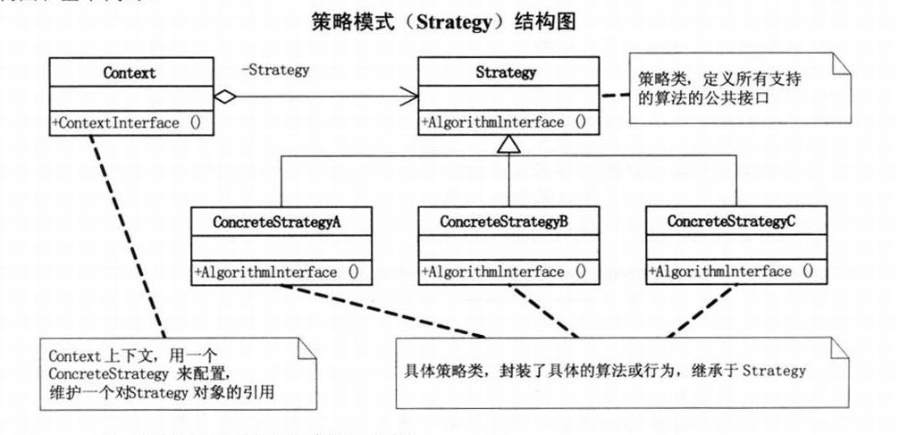
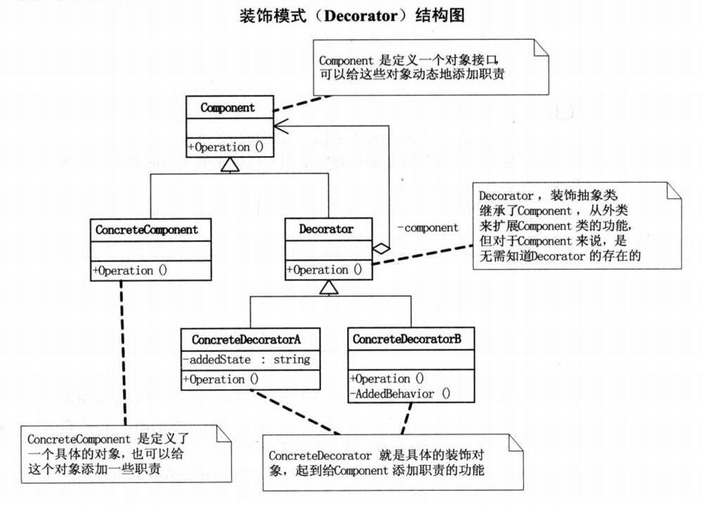

# 设计模式

## UML 类图

- TODO

## 设计模式的原则

- 1、开闭原则（Open Close Principle）

  - 开闭原则的意思是：对扩展开放，对修改关闭。在程序需要进行拓展的时候，不能去修改原有的代码，实现一个热插拔的效果。简言之，是为了使程序的扩展性好，易于维护和升级。想要达到这样的效果，我们需要使用接口和抽象类，后面的具体设计中我们会提到这点。

- 2、里氏代换原则（Liskov Substitution Principle）

  - 里氏代换原则是面向对象设计的基本原则之一。 里氏代换原则中说，任何基类可以出现的地方，子类一定可以出现。LSP 是继承复用的基石，只有当派生类可以替换掉基类，且软件单位的功能不受到影响时，基类才能真正被复用，而派生类也能够在基类的基础上增加新的行为。里氏代换原则是对开闭原则的补充。实现开闭原则的关键步骤就是抽象化，而基类与子类的继承关系就是抽象化的具体实现，所以里氏代换原则是对实现抽象化的具体步骤的规范。

- 3、依赖倒转原则（Dependence Inversion Principle）

  - 这个原则是开闭原则的基础，具体内容：针对接口编程，依赖于抽象而不依赖于具体。

- 4、接口隔离原则（Interface Segregation Principle）

  - 这个原则的意思是：使用多个隔离的接口，比使用单个接口要好。它还有另外一个意思是：降低类之间的耦合度。由此可见，其实设计模式就是从大型软件架构出发、便于升级和维护的软件设计思想，它强调降低依赖，降低耦合。

- 5、迪米特法则，又称最少知道原则（Demeter Principle）

  - 最少知道原则是指：一个实体应当尽量少地与其他实体之间发生相互作用，使得系统功能模块相对独立。

- 6、合成复用原则（Composite Reuse Principle）
  - 合成复用原则是指：尽量使用合成/聚合的方式，而不是使用继承。

## 简单工厂模式

- 
- 简单工厂模式(Simple Factory Pattern)：又称为静态工厂方法(Static Factory Method)模式，它属于类创建型模式（同属于创建型模式的还有工厂方法模式，抽象工厂模式，单例模式，建造者模式）。在简单工厂模式中，可以根据参数的不同返回不同类的实例。简单工厂模式专门定义一个类来负责创建其他类的实例，被创建的实例通常都具有共同的父类。
- 组成： 简单工厂模式由三部分组成：具体工厂、具体产品和抽象产品。
  - 工厂类（Creator）角色：担任这个角色的是简单工厂模式的核心，含有与应用紧密相关的商业逻辑。工厂类在客户端的直接调用下创建产品对象，它往往由一个具体类实现。
  - 抽象产品（AbstractProduct）角色：担任这个角色的类是由简单工厂模式所创建的对象的父类，或它们共同拥有的接口。抽象产品角色可以用一个接口或者抽象类实现。
  - 具体产品（ConcreteProduct）角色：简单工厂模式所创建的任何对象都是这个角色的实例，具体产品角色由一个具体类实现。
- 模式动机：
  - 使用简单工厂模式可以将产品的“消费”和生产完全分开，客户端只需要知道自己需要什么产品，如何来使用产品就可以了，具体的产品生产任务由具体的工厂类来实现。工厂类根据传进来的参数生产具体的产品供消费者使用。这种模式使得更加利于扩展，当有新的产品加入时仅仅需要在工厂中加入新产品的构造就可以了。
- 优点
  - 工厂类是整个模式的关键.包含了必要的逻辑判断,根据外界给定的信息,决定究竟应该创建哪个具体类的对象.通过使用工厂类,外界可以从直接创建具体产品对象的尴尬局面摆脱出来,仅仅需要负责“消费”对象就可以了。而不必管这些对象究竟如何创建及如何组织的．明确了各自的职责和权利，有利于整个软件体系结构的优化。
- 缺点
  - 由于工厂类集中了所有实例的创建逻辑，违反了高内聚责任分配原则，将全部创建逻辑集中到了一个工厂类中；它所能创建的类只能是事先考虑到的，如果需要添加新的类，则就需要改变工厂类了。
  - 当系统中的具体产品类不断增多时候，可能会出现要求工厂类根据不同条件创建不同实例的需求．这种对条件的判断和对具体产品类型的判断交错在一起，很难避免模块功能的蔓延，对系统的维护和扩展非常不利；
  - 这些缺点在[工厂方法模式](.)中得到了一定的克服。

## 策略模式

- 
- 意图：定义一系列的算法,把它们一个个封装起来, 并且使它们可相互替换。
- 主要解决：在有多种算法相似的情况下，使用 if...else 所带来的复杂和难以维护。
- 何时使用：一个系统有许多许多类，而区分它们的只是他们直接的行为。
- 优点： 1、算法可以自由切换。 2、避免使用多重条件判断。 3、扩展性良好。
- 缺点： 1、策略类会增多。 2、所有策略类都需要对外暴露。
- 使用场景： 1、如果在一个系统里面有许多类，它们之间的区别仅在于它们的行为，那么使用策略模式可以动态地让一个对象在许多行为中选择一种行为。 2、一个系统需要动态地在几种算法中选择一种。 3、如果一个对象有很多的行为，如果不用恰当的模式，这些行为就只好使用多重的条件选择语句来实现。
- 注意事项：如果一个系统的策略多于四个，就需要考虑使用混合模式，解决策略类膨胀的问题。

## 装饰模式

- 
- 装饰模式指的是在不必改变原类文件和使用继承的情况下，动态地扩展一个对象的功能。它是通过创建一个包装对象，也就是装饰来包裹真实的对象。
- 以下情况使用 Decorator 模式
  - 需要扩展一个类的功能，或给一个类添加附加职责。
  - 需要动态的给一个对象添加功能，这些功能可以再动态的撤销。
  - 需要增加由一些基本功能的排列组合而产生的非常大量的功能，从而使继承关系变的不现实。
  - 当不能采用生成子类的方法进行扩充时。一种情况是，可能有大量独立的扩展，为支持每一种组合将产生大量的子类，使得子类数目呈爆炸性增长。另一种情况可能是因为类定义被隐藏，或类定义不能用于生成子类。
- 优点
  - Decorator模式与继承关系的目的都是要扩展对象的功能，但是Decorator可以提供比继承更多的灵活性。
  - 通过使用不同的具体装饰类以及这些装饰类的排列组合，设计师可以创造出很多不同行为的组合。
- 缺点
  - 这种比继承更加灵活机动的特性，也同时意味着更加多的复杂性。
  - 装饰模式会导致设计中出现许多小类，如果过度使用，会使程序变得很复杂。
  - 装饰模式是针对抽象组件（Component）类型编程。但是，如果你要针对具体组件编程时，就应该重新思考你的应用架构，以及装饰者是否合适。当然也可以改变Component接口，增加新的公开的行为，实现“半透明”的装饰者模式。在实际项目中要做出最佳选择。
- 代码中的应用
  - IO流的操作就是典型的装饰模式